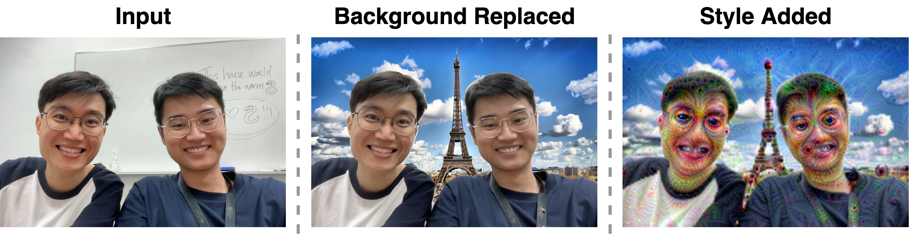

# Photobooth-CV 📸 🖼️
Built by: [Joel Lim](https://www.linkedin.com/in/joel-lim-988bb91bb/) and [Khai Loong Aw](https://awwkl.github.io/)



## Introduction

Photobooth-CV is an app built using computer vision. Users can bring their friends to take a group photo, or supply a photo taken beforehand as the input. We produce an output image first by replacing the background (e.g., to the Eiffel Tower in Paris), followed by adding stylistic effects (e.g., DeepDream, see image above). We built this as a project for our university data science club ([SMU BIA](https://smubia.com/)) to showcase at different university events.

Key features:
- Works for both single-person and multi-person group photos
- Works well even for people wearing items like hats or bags, capturing them in the foreground

## How to Use: 
```
pip install -r requirements.txt
streamlit run streamlit_app.py
```

Our app is also deployed online (may be taken down in future): TODO

## Additional Details

### Method - Step 1: Replace Background

First, we use an image segmentation model, [DETR ResNet-50](https://huggingface.co/facebook/detr-resnet-50-panoptic), to identify foreground pixels, i.e., pixels with the "person" class label or selected categories of items people might wear, such as hats or bags. Next, we identify the background pixels by selecting the pixels not labeled as foreground. We replace these background pixels with pixel data from a new background photo (e.g., of the Swiss Alps). 

### Method - Step 2: Add Styles

The background-replaced image (from Step 1) is passed to the DeepDream model in `pytorch_deepdream/`, adapted from [Aleksa Gordić's DeepDream implementation](https://github.com/gordicaleksa/pytorch-deepdream). We run the DeepDream model with a learning rate of 0.09 for 2 iterations. We selected these hyperparameters after a process of experimentation to ensure it works well on the domain of images we expect to capture in our photo booth. In particular, we chose a smaller number of iterations and a higher learning rate than the default settings, to reduce the wall clock time to produce an output image, as we do not use GPUs (we bring a laptop to our photo booth at these university events) and there might be students queueing to try out our photo booth.

### Libraries
- PyTorch, HuggingFace - for deep learning models
- Pandas, Numpy, OpenCV, Pillow - for image and numerical manipulations
- Streamlit - for building the web application
- Docker, AWS EC2 - for cloud deployment

### Literature Review (including other models we tried)

We tried many different computer vision models for background replacement and adding stylistic effects. All the models we tried were great, but we settled on DETR and DeepDream as they produced the best outputs for our specific use case, i.e., multi-person group photos with people carrying bags/bottles/items.

**Background Replacement.** Initially, we tried models trained for salient object detection / foreground detection, e.g., [U2-Net](https://github.com/xuebinqin/U-2-Net). However, these models often captured undesired foreground objects, such as tables or chairs. Additionally, they were not flexible enough for our use case where we wish to provide a specific list of categories to include in the foreground, such as persons, hats and bags.

**Style Transfer.** First, we tried to find style transfer models specialized for human style transfer, as opposed to general objects or scenes. However, many of these models were trained on single-person face portraits. From early experiments, we observed that these single-portrait style transfer models work well when passing in images zoomed in on a face portrait. However, passing group photos with multiple persons resulted in blurry face defects that felt jarring. This is likely because group photos are outside the training distribution and faces are only a small portion (and hence a lower resolution) of a multi-person group photo. We tried models such as [AnimeGANv2](https://github.com/bryandlee/animegan2-pytorch) and [DualStyleGAN](https://github.com/williamyang1991/DualStyleGAN). 

Next, to address the blurry face defects, we experimented with models that were focused on photorealistic style transfer, i.e., maintaining high-resolution details and photorealism. Despite our best efforts, we found that the resulting outputs were mostly color-changed versions of the input images (these models seem to transfer only color changes), which was not our desired goal. We tried models such as [PhotoWCT2](https://github.com/chiutaiyin/PhotoWCT2).

Finally, we also experimented with recently-released diffusion-based style transfer models, because we thought that newer models might perform better and saw they also focused on photorealism. These models include [StyleID](https://github.com/jiwoogit/StyleID), [LSAST](https://github.com/jamie-cheung/lsast), [DiffStyler](https://github.com/lishaoxu1994/diffstyler), and [Z-STAR](https://github.com/HolmesShuan/Zero-shot-Style-Transfer-via-Attention-Rearrangement). One really interesting model is the text-conditioned [LEAST](https://github.com/silky1708/local-style-transfer), which allows to input a text string, e.g., "apply cubism style to the left donkey", offering enormous flexibility. However, these models contain a large number of parameters, so we faced issues with loading them into our RAM and taking too long to run on our CPU-only laptops. 

Experimenting with these models was a great learning experience. We are very thankful for the authors who produced these models and released their code. However, we found they were not well-suited for our specific photo booth use case.

### More Results

TODO: show 3-5 sample images and outputs, in the same format as the topmost introduction figure

### Conclusion
TODO: Remove this section?

### Learning Points
TODO: Remove this section?

### Future Work

We aim to experiment with additional style transfer models. In particular, models that transfer abstract styles like cubism or line art, as the output images will still look reasonable even if minor visual defects are introduced. Furthermore, due to our compute constraints, we are looking at older models with smaller parameters, i.e., not diffusion-based. For the next version of our photo booth, we plan to experiment with:
- [CycleGAN](https://github.com/junyanz/CycleGAN)
- [StyTr^2 : Image Style Transfer with Transformers](https://github.com/diyiiyiii/StyTR-2)
